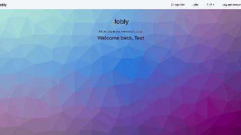
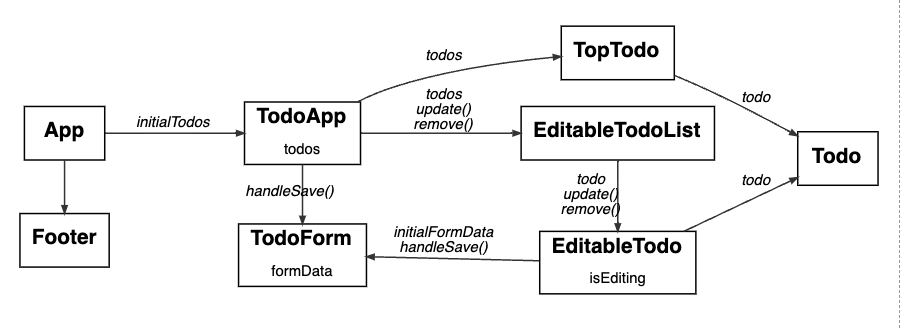

# Jobly

Jobly is a web application built using React that allows users to search and apply for job listings. Users can sign up, log in, and update their profile information.
This app maintains 100% test coverage.

## [Live Demo Link](https://jobz4u.surge.sh/)

## Features

### Current Features
- User authentication and authorization
- Search for jobs by keyword or search for companies by name
- View job details, including company, salary and equity
- View and edit profile details

### Future Features
- Apply to jobs
- View all job applications for logged in user

## Getting Started

To get started with Jobly, follow the steps below:

### Backend

1. Clone the repository to your local machine.
2. Navigate to the backend directory: `cd backend`.
3. Install backend dependencies with `npm install`.
4. Start the backend server with `npm start`.
5. The backend server will start running at `http://localhost:3001`.

### Frontend

1. Open a new terminal.
2. Navigate to the frontend directory: `cd frontend`.
3. Install dependencies with `npm install`.
4. Start the frontend development server with `npm start`.
5. Open `http://localhost:5173` in your browser.

## Testing
Tests are run using Jest for the backend and Vitest for the frontend. To run the tests for both the frontend and backend, follow the steps below:

### Backend Tests
1. Open a terminal.
2. Navigate to the backend directory: `cd backend`.
3. Run `npm test` to execute the backend tests.

### Frontend Tests
1. Open a new terminal.
2. Navigate to the frontend directory: `cd frontend`.
3. Run `npm test` to execute the frontend tests.

## Tech Stack

- PostgreSQL for database
- Node/Express for backend
- React for frontend

## Dependencies

Backend:
- express
- cors
- dotenv
- bcrypt
- jsonwebtoken
- jsonschema
- morgan
- pg
- body-parser

Frontend:
- bootstrap
- react
- react-dom
- react-router-dom
- react-jwt

## Illustrations
### React Component Hierarchy

## Authors

- Gracee Gallivan
- David Sapiro (frontend pair programming partner)
- Max Jeon (backend pair programming partner)
